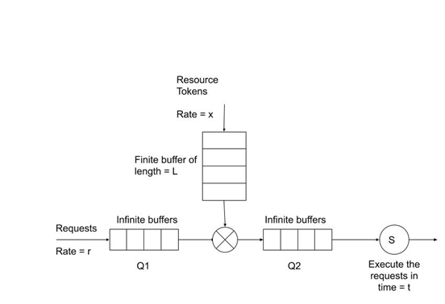

# Traffic Shaper

## System Architecture



## Compile
```shell
$ make trafficshaper
```

## Clean
```shell
$ make clean
```

## Commandline Arguments Use
```shell
$ ./trafficshaper [-r r] [-R R] [-L L] [-x x] [-t t]
```

## Run
Using Default Parameters
```shell
$ ./trafficshaper
```

Using Parameters Input from User
```shell
$ ./trafficshaper -r 10 -R 5 -L 50 -x 1 -t 5
```
